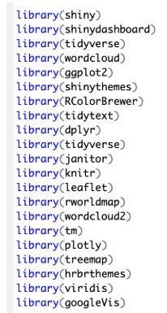
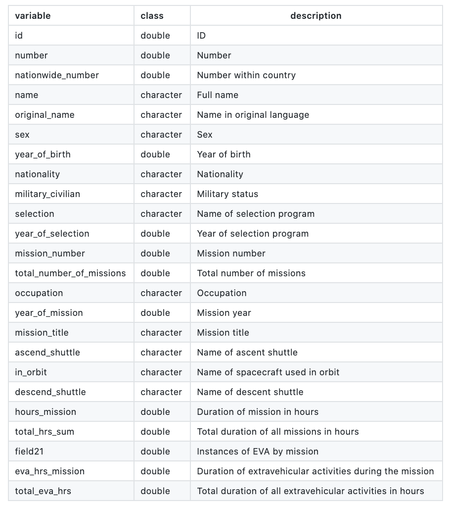
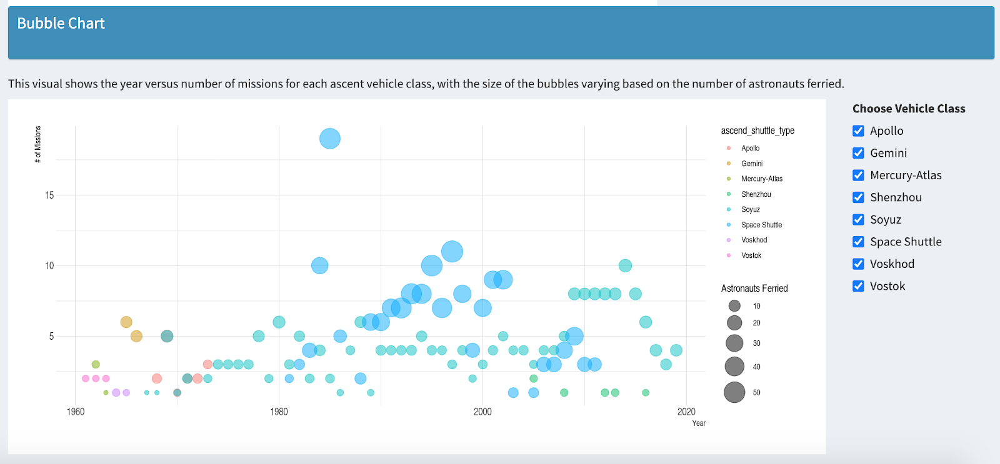
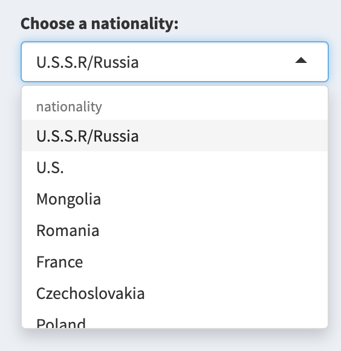

```{r setup, include=FALSE}
knitr::opts_chunk$set(echo = TRUE)
```


## Introduction: Domain problem characterization
Upon investigating our dataset, we realized that there was no comprehensive way to understand the raw data for anyone that wanted to view it. It was scattered and unorganized in the raw file format and needed to be cleaned in order to have sufficient interpretation capabilities. The problem we wanted to solve was the lack of organization and comprehensive, easy-to-analyze data. Visuals are great formats to use when exploring large amounts of data. For this reason, we wanted to create a dashboard that would aid the lack of comprehensive astronaut data analysis for the final user. 

The dashboard provides a means of analyzing data in a simple manner. It also allows the user to eliminate unnecessary noise in the data that can hinder comprehension. We wanted to help them monitor statistics in a refined order and solve the issue of having to navigate complex data tables. It also allows users to track the history of the astronauts and their missions in a comprehensible manner. Users can utilize the visualizations to identify patterns within the collected data. For example, they can see which space shuttles work the best or which astronauts have gone on the most amount of missions (See Figure 3). 

The dashboard can also identify areas of improvement within the aerospace industry. Based on the tracked data and simplified analysis for non-technical users, they can see areas that are lacking in performance or other issues in a cohesive way. For example, we can see that in the span of the years that space travel has existed, there is a significant majority of male astronauts as opposed to females; those changes can be tracked throughout the years and can be something the industry works to solve. The dashboard also puts international space travel into perspective and can solve some questions one might have. It provides an overview of different countries and their space exploration contributions, and helps users get a better understanding of international space data and their advancements. 
 
## Data & Operation Astraction Design 
Our dataset was taken from the July 14th “#TidyTuesday” event, provided by Mariya Stavnichuk and Tatsuya Corlett who collected the data from NASA, Roscosmos, and fun-made websites. It contains information about astronauts participating in space missions up until the 15th of January, 2020. Through the columns in the database, we were able to gather information about the astronauts, including name, sex, birthdate, nationality, occupation, name and year of their selection program, in addition to each of their specific missions completed and details consisting of mission year, title, ascent/ in orbit/ descent vehicles, duration, and many others (See Figure 2). 

Basic data cleaning was done to the entire dataset before we began creating our shiny app. The clean_names feature was used to clean the names in the data frame so that the resulting names would be unique and consist only of the ‘_’ character, letters, and numbers. Next, the filter function was used to remove the last row as all of the values were null. Finally, the mutate and if_else functions were used to modify the sex and military_civilian columns.

To develop the dataset needed for our bubble chart visualization, the ascend_shuttle column was processed to create the ascend_shuttle_type column, which categorized each ascent shuttle into one of eight vehicle classes, Vosotok, Space Shuttle, Mercury-Atlas, Gemini, Soyuz, Apollo, Voskhod, Shenzhou, or NA. Next, the astronaut dataset was filtered to create the shuttle_summary dataset, which included the ascend shuttle type, ascend shuttle name, number of astronauts ferried, the year of the mission, and number of missions completed. Finally, another dataset was created, mission_summaries, which grouped the shuttle_summary dataset by ascent_shuttle_type and year, to display the total number of completed missions and astronauts ferried by each vehicle class for each year it was used. A few other modifications and filtering commands were needed in order to create the mission hours versus countries plot, as well as the word cloud featuring astronaut names. 
 
## Encoding & Interaction Design
We have created the app by focusing on what the users would want and ensuring that the interface has the elements that are easy to access, understand and navigate. We have created a sidebar that consists of a list of menus like Dashboard, Table, Charts and Animation. The menu items have headers and assigned text that is displayed on the web page using the dashboardSidebar function. 
 
We implemented a fluid page layout by including functions like fluidRow to create a grid-based layout. We have also added control widgets like actionbutton, sliderinput for the users (see Figure 4). When the user changes the widget, the value will change as well. We have made sure the application is easy to understand and navigate so that the users can easily understand the data behind the different visuals including all the characteristics. 
 
We kept similar charts and visualizations on the same menu page so that it is easier to navigate between different pages. For example, the first dashboard menu has items related to word plot and bubble plot to give an overall picture of the astronaut’s names and space shuttle used during the mission. The second menu item has only one table with easy to search features for every column. We kept all static charts on menu item three and two animations on animate menu item so that users do not have to hop back and forth between the same type of visuals.

## Algorithmic Design 
In order to improve algorithmic design and app responsiveness, we chose to keep our dashboard simple and not overwhelming for the users. We also had to customize our data for manipulation by mutating and filtering it using dplyr. This aided in speeding up the processing time and improving functionality. By creating new datasets that were subsets of the original astronaut database, we were also able to call and calculate the aspects of the data we specifically needed as opposed to unnecessarily involving the entire dataset. We also deployed our application to shinyapps.io to ensure it met an acceptable performance and limited processing time. 

Doing this increased the functionality of our application and improved the design structure of each of our visual application interactions. The algorithm design choices we made throughout application development also allowed it to be scalable. If we were to add more data and visualizations to it, it would still function efficiently as we have chosen to simplify our designs and avoid extreme complexity. We created a design that we felt was simple, yet effective in achieving our goals with visualization and analysis, which maximized the functionality of the application. It was also organized into tabs that displayed relevant information, which maintained a professional appearance through a user-friendly approach. 

We used various packages in our shiny app to improve the quality and functionality of the program. This included packages such as viridis, rcolorbrewer, and hrbrthemes to help with the color palette. We used wordcloud, treemap, plotly, and ggplot2 to aid in the visual design. We used shinydashboard, and shiny to aid in creating the web page design, allowing our program and design to function holistically. Other packages included tidyverse,knitr, leaflet and many more (See Figure 1). Using these packages also aided us in creating more efficient design as it helped reduce the necessity of certain coding aspects. This also contributed to our application being more holistic. 

## User Evaluation
We tested our system for consistency between the dataset and the visualizations. We worked to cross check the data validity and the visual accuracy presented within the dashboard. We also tested our design to ensure that each individual component was performing accordingly. The sliders needed to correctly represent the word clouds and the rearrange function was correctly displaying the words within the cloud. We also tested responsiveness and how fast it would work and ensured the loading time was not overly lagging. 

Additionally, the animations we used show the data we wanted to display which was tested as we were designing the systems. The static charts are also proportional to the data set and it is accurately represented. In terms of testing with users, we would conduct some experiments with final users that are familiar with using dashboards and users that are not in order to help improve the understandability and user friendliness of our application. We would also survey them to see their suggestions. This would provide a benchmark for what we need to redesign to create a better user experience.

In order to further test and improve our system we would ask a few aerospace management employees to review it for feedback. We would work to improve upon the system based on those results as they are the final users of this product and it should be simple for them to navigate through. For example, if the user wanted to see more visuals under one item, we would work to create those so they can have a better comprehension of the data. 
 
## Future Work 
In the future works of this project, we would aim to add a new menu item for predictive modeling, we will predict the duration of an astronauts mission in space. This would require building a model to predict how long a person was on a mission based on other information about the individual in the data set like occupation, type of spacecraft,name of country, the mission belonged to, and more. It will be a regression model using bagging, and bootstrap aggregating. We want to see the hours spent by the astronauts in space over the decades and understand what in the dataset is related to the change in the time spent by these individuals from weeks to months over the years. We will add a visual of time prediction of time spent by a astronaut in space. Also, we want to expand our chart to world map, where we will also show the location of country of a astronaut.

We can predict if the time spent in space depends on if the astronaut was a military official or a civilian. Whether a special training was required to be in space for a longer duration. Also, what kind of spacecraft was used to send these astronauts to space? Or if it was a specific country that was sending their astronauts to space for a longer period of time.We can start by predicting how the duration of a mission has changed over time. This duration is what we want our model to predict using other information in this per astronaut’s mission data. 

We can then bucket the different spacecraft together (such as the space shuttle missions) and the mission length. We can then test this model to see if there is a correlation between the spacecraft and the duration of the mission.That will give us some insight into what kind of spacecraft had the capacity to stay in outer space for an extended period of time. We can then test this model to see if there is a correlation between the spacecraft and the duration of the mission. We can further predict if the occupation of the astronaut has any correlation with their time spent in space.
 
## Appendix 
Github: https://github.com/ParvinderTomar/Astronauts

RStudio : https://rstudio.cloud/spaces/76559/project/1484495

Shinyapp.io: https://parvinder-tomar.shinyapps.io/Final_app/

 
```{r pressure, echo=FALSE, message =FALSE,fig.cap="Image", out.width = '100%'}
library(knitr)






```


 
 
